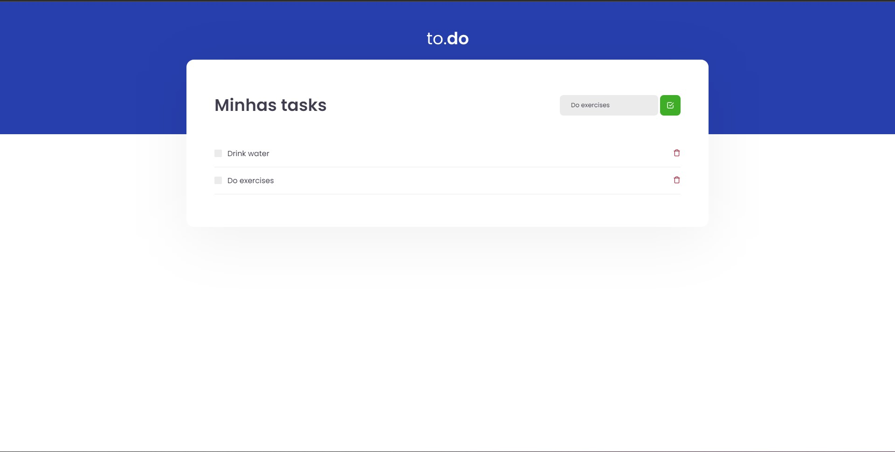

# To Do

Challenge proposal for Ignite course on React track / Proposta de desafio do curso Ignite na trilha de React

🚀 **Como rodar o projeto / Running the project**

- Rode o projeto / Star project 
`yarn dev`

- Rode os testes unitários / Run unit tests
`yarn test`

-------------------------------------------------------------------------------------------------------------

⚙️ **Tecnologias utilizadas / Used Technologies**

- [React](https://reactjs.org/)
- [Typescript](https://reactjs.org/)
- [Jest](https://jestjs.io/)
- [React Testing Library](https://testing-library.com/docs/react-testing-library/intro)

-------------------------------------------------------------------------------------------------------------

🧑🏾‍💻 **Autor / Author**

**Matheus Gomes de Souza**

LinkedIn: https://www.linkedin.com/in/matheus-gomes-de-souza/  
E-mail: matheusg_souza@outlook.com
